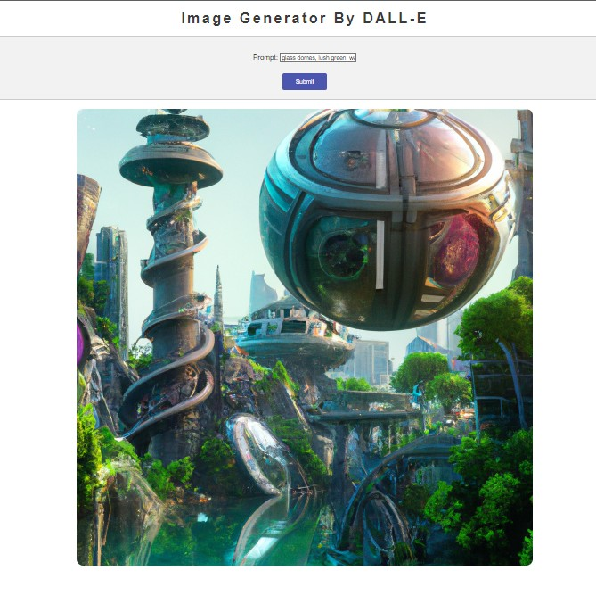

# DALL-E
DALL-E is a repository that generates images using OpenAI API key written in Python using Django1.


#### This repository is built with Python Django and OpenAI API key. It allows you to generate images using DALL-E API by OpenAI.

## How to use
To use this repository, you need to paste your OpenAI API key in line ``` openai.api_key = "Paste_Your_API_Key_Here" in views.py. ```

### To run this project, you can follow these steps:

* Clone this repository.
* Install all the required packages using ``` pip install -r requirements.txt. ```
* Paste your OpenAI API key in line ``` openai.api_key = "Paste_Your_API_Key_Here" in views.py. ```
* Run the server using ``` python manage.py runserver. ```
