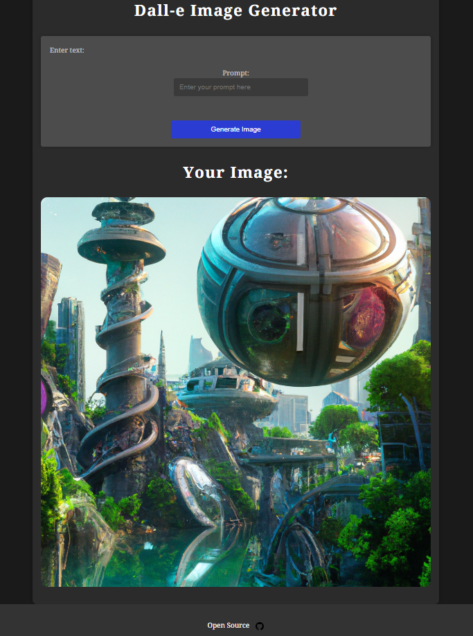

# 🎨DALL-E


<p align="center">
    
</p>


<p align="center">
    <a href="https://github.com/ElonMusk2002/DALL-E/stargazers"></a>
    <a href="https://github.com/ElonMusk2002/DALL-E/network/members"></a>
    <a href="https://github.com/ElonMusk2002/DALL-E/watchers"></a>
</p>

## 📝Introduction

This repository is built with Python Django and uses the DeepAI API key. It allows you to generate images using DALL-E API by DeepAI.

## 💻Installation

To use this repository, follow these steps:

1. Clone this repository.

2. Install all the required packages using the following command: 

   ```
   pip install -r requirements.txt
   ```

3. In `views.py`, replace `Paste_Your_API_Key_Here` with your OpenAI API key: 

   ```python
   openai.api_key = "<Paste_Your_API_Key_Here>" 
   ```

## 🚀Usage

<p align="center">
    Run the server using the following command: 
    <br>
    <code>python manage.py runserver</code>
</p>

This will start the server and you can now generate images using the DALL-E API.

## 📊Statistics

<p align="center">
    
    
    
    <a href="https://github.com/ElonMusk2002/DALL-E/issues"></a>
    <a href="https://github.com/ElonMusk2002/DALL-E/pulls"></a>
</p>

## 🙌Contributing

Contributions are always welcome!


## Thank You 🙏

Thank you for checking out this project! If you find it helpful or interesting, your support would be greatly appreciated.

- ⭐️ Star the project on [GitHub](https://github.com/ElonMusk2002/DALL-E)
- 🐛 Open an [issue](https://github.com/ElonMusk2002/DALL-E/issues) if you found a bug
- 🛠️ Submit a [pull request](https://github.com/ElonMusk2002/DALL-E/pulls) to contribute

Feel free to reach out if you have any questions or suggestions!
